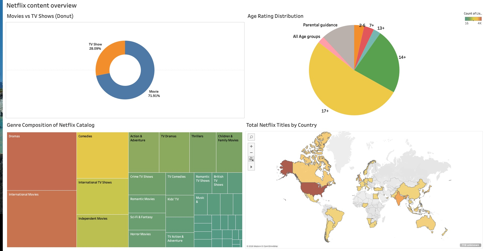
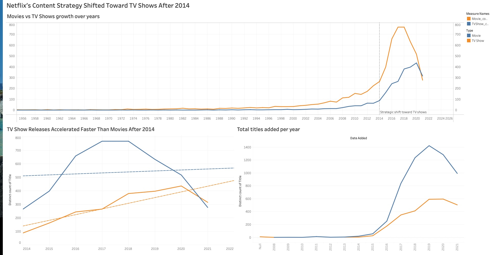
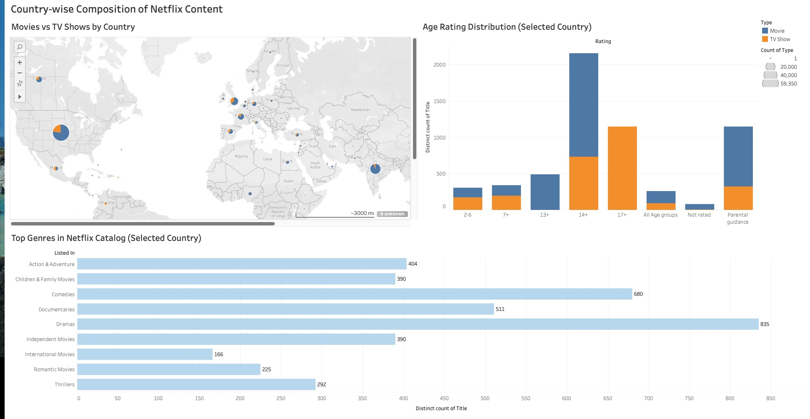

# Netflix Content Intelligence: Recommendation System, Network Analysis & Dashboards

This project delivers a comprehensive content intelligence platform for Netflix titles, combining:
- 🧠 **NLP-powered recommendations**
- 🔗 **Interactive network analysis**
- 📊 **Visual analytics dashboards**

---

## 🔍 1. Content-Based Recommendation System

Built using **Sentence Transformers** to recommend top 5 similar titles based on plot descriptions.

### Features:
- Semantic embeddings via `all-MiniLM-L6-v2`
- Cosine similarity for relevance scoring
- Filters by content **type** (Movie/TV) and **age rating**
- Precomputed embeddings for fast lookup

### Workflow:
1. Cleaned and preprocessed metadata  
2. Generated embeddings for each title  
3. Computed cosine similarity matrix  
4. Returned top-5 similar titles for a given input  
5. Applied optional filters on type/rating

---

## 🔗 2. Network Analysis (Bipartite Graphs)

Used **Bokeh** and **NetworkX** to build interactive bipartite graphs that reveal relationships between entities like titles, genres, directors, and cast.

### Graphs:
| Graph Type | Description | File |
|------------|-------------|------|
| 🎭 Cast–Title | Shows which cast appear in which titles | [`Cast_Title_Bipartite.html`](network_analysis/Cast_Title_Bipartite.html) |
| 🎬 Director–Title | Links directors to their titles | [`Director_Title_Bipartite.html`](network_analysis/Director_Title_Bipartite.html) |
| 🎞️ Director–Genre | Reveals preferred genres of each director | [`Director_Genre_Bipartite.html`](network_analysis/Director_Genre_Bipartite.html) |
| 🎥 Director–Cast | Shows frequent collaborations | [`Director_Cast_Bipartite.html`](network_analysis/Director_Cast_Bipartite.html) |
| 🌐 Combined Network View | Unified view of all major entity relationships | [`Combined_Network_Graph.html`](network_analysis/Combined_Network_Graph.html) |

> To view: open each `.html` file in your browser. Graphs are zoomable and pannable.

---

## 📊 3. Tableau Dashboards

Designed interactive dashboards to visualize Netflix’s content strategy, catalog trends, and regional distribution.

### Dashboard 1: **Content Overview**
- Type split (Movie vs TV)
- Genre distribution
- Rating mix
- Global availability  

---

### Dashboard 2: **Strategic Shift Toward TV Shows**
- Year-wise content releases
- Rise of TV content post-2014  

---

### Dashboard 3: **Country-wise Composition**
- Content type per country
- Genre and rating by region  

> Tableau `.twbx` files are located in `/dashboards/` folder.  
> Open in [Tableau Desktop](https://www.tableau.com/) for interactivity.

---

## 📁 Folder Structure
├── src/                    # Python code for recommendation logic
├── network_analysis/       # Bipartite graphs + notebook
├── dashboards/             # Tableau .twbx files
├── images/                 # Screenshots for README
├── docs/                   # HTML files for GitHub Pages
└── README.md

---

## 🧠 Skills Demonstrated

| Area | Tools / Techniques |
|------|--------------------|
| NLP & Recommendations | Sentence Transformers, Cosine Similarity |
| Graph Analytics | Bipartite Networks, NetworkX, Bokeh |
| Visual Analytics | Tableau (KPI dashboards, filters, interactions) |
| Data Handling | Preprocessing, Filtering, Text Cleaning |
| Interactivity | HTML graph publishing, dashboard integration |

---

## 🚀 How to Run
- 📦 Recommendation engine: run scripts in `/src/` folder.
- 🌐 Network analysis: open HTML files in browser.
- 📊 Tableau dashboards: open `.twbx` in Tableau Desktop.

---

## 📌 Future Enhancements

- Hybrid recommender (Collaborative + Content)
- Graph-based recommendations using edge weights
- Web UI integration using Flask or Streamlit
- Live Tableau Public deployment for dashboards

---